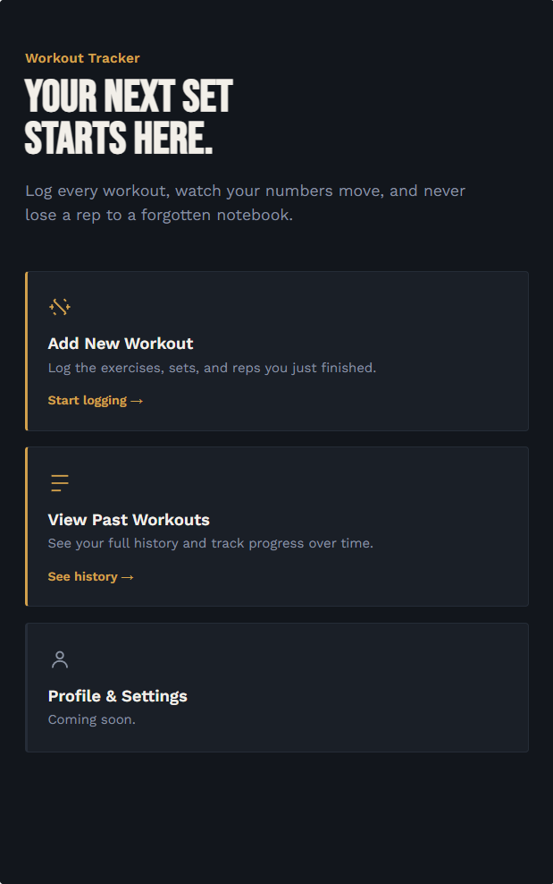

# Workout Tracker

A full-stack workout logging app built to learn full-stack development end to end; a FastAPI backend with a real database and a plain HTML/CSS/JS frontend.



## Features

**Current**
- REST API for creating and retrieving workouts, with each workout holding multiple exercises (sets, reps, weight)
- SQLite database with a proper relational schema (one workout → many exercises)
- Auto-generated, interactive API docs via FastAPI's `/docs` endpoint
- Landing page with navigation to the core actions of the app

**Planned**
- Functional "Add Workout" form that submits directly to the API
- "View Past Workouts" page displaying real logged history
- Basic progress charting (e.g. weight lifted over time, per exercise)
- User accounts / profile page

## Tech Stack

| Layer | Tool |
|---|---|
| Backend | Python, FastAPI |
| Database | SQLite via SQLAlchemy ORM |
| Server | Uvicorn |
| Frontend | HTML, CSS, vanilla JavaScript |

## Project Structure

```
workout-tracker/
├── main.py           # FastAPI app and route definitions
├── models.py         # SQLAlchemy database models (Workout, Exercise)
├── schemas.py        # Pydantic request/response schemas
├── database.py       # Database connection and session setup
├── requirements.txt  # Python dependencies
└── frontend/
    ├── index.html         # Landing page
    ├── styles.css         # Shared styling
    ├── add-workout.html   # Placeholder — form coming soon
    └── view-workouts.html # Placeholder — history view coming soon
```

## Getting Started

**1. Clone the repo**
```
git clone https://github.com/byork30/workout-tracker.git
cd workout-tracker
```

**2. Set up a virtual environment**
```
python -m venv venv
venv\Scripts\activate        # Windows
source venv/bin/activate     # macOS/Linux
```

**3. Install dependencies**
```
pip install -r requirements.txt
```

**4. Run the backend**
```
uvicorn main:app --reload
```
The API is now running at `http://127.0.0.1:8000`. Visit `http://127.0.0.1:8000/docs` for interactive API docs.

**5. View the frontend**
Open `frontend/index.html` directly in your browser.

## API Endpoints

| Method | Endpoint | Description |
|---|---|---|
| POST | `/workouts` | Create a new workout with its exercises |
| GET | `/workouts` | List all workouts, most recent first |
| GET | `/workouts/{id}` | Get a single workout by id |

## Author

Blane York — [GitHub](https://github.com/byork30) · [LinkedIn](https://www.linkedin.com/in/blane-york/)
